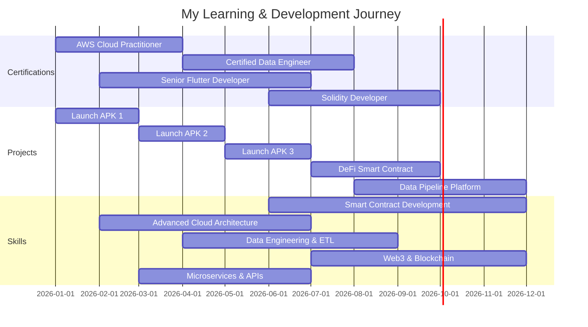

<div align="center">


<p>
  
  
  
</p>

### 🚀 ABOUT ME
<table>
<tr>
<td width="50%" valign="top" align="left">

```dart
class Developer {
  final String name = "Derrick Juma";
  final String role = "Software Engineer";
  
  List<String> currentStack = [
    "Flutter & Dart",
    "Kotlin & JPC",
    "Python (AI/ML)",
    "Firebase & Cloud",
  ];
  
  List<String> exploring = [
    "Blockchain & Smart Contracts",
    "Advanced ML Architectures",
    "Spring Boot for backend",
    "Serverless & Edge Computing",
  ];
  
  String motto = "Code with purpose,"
                 "ship with confidence";
}
```

<div align="left">

### 💫 What I'm Up To

🎨 Building healthcare solutions with **Flutter & AI**  
🔥 Exploring **Blockchain × AI × Mobile** possibilities  
💼 Portfolio: [derrickjuma.netlify.app](https://derrickjuma.netlify.app)

### 🤝 Let's Collaborate

✨ Open to **Flutter • AI/ML • Open Source** projects  
♟️ Solving chess puzzles between `flutter run` commands  

</div>
</td>
<td width="50%" align="center">

</td>
</tr>
</table>


## 🛠️ Tech Arsenal

<details open>
<summary><b>Click to expand my toolkit</b></summary>

<br/>

**Mobile Development**
```
Flutter  ████████████████████░  95%
Dart     ████████████████████░  95%
Kotlin   ███████████████░░░░░  75%
Android  ██████████████░░░░░░  70%
```

**AI & Data**
```
TensorFlow  ████████████████░░░░  80%
Python      ███████████████████░  95%
FastAPI     ██████████████████░░  90%
scikit-learn ███████████████░░░░  75%
```

**Backend & Cloud**
```
Firebase     ████████████████████  100%
PostgreSQL   ███████████████░░░░░  75%
REST APIs    ████████████████████  100%
Docker       ██████████████░░░░░░  70%
Spring Boot  ██████████████░░░░░░  70%

```
**Blockchain & Web3**
```
Solidity  ██████████████░░░░░░  70%

```

</details>

## 📊 GitHub Statistics

<div align="center">
  
  
</div>

<div align="center">
  
</div>

<div align="center">
  <!-- Contribution Graph -->
  
</div>

---

## 🏆 **ACHIEVEMENTS & TROPHIES**

<div align="center">

</div>

---

## 🚀 Featured Projects

<div align="center">

| Project | Description | Tech Stack | Impact | Links |
|---------|-------------|------------|--------|-------|
| 🏠 **Unistay Housing** | AI-powered student housing recommendation with smart filtering | Flutter • FastAPI • ML | 500+ users, 89% accuracy | [Demo](https://github.com/kude-craft/house_recommendation_app) |
| 📚 **SmartPace** | Intelligent study planner with AI-driven scheduling | Flutter • Firebase • AI | 200+ students, 4.8★ rating | [Beta](https://github.com/jude-craft/SmartPace) |
| 👨‍💼 **ShopMate** | Sales tracking app for small businesses | Flutter • Firebase | 50+ businesses, 95% accuracy | [Download](https://github.com/jude-craft/ShopMate) |
| 📊 **Rent Predictor** | ML model for housing rent prediction in Nairobi | Python • XGBoost • ML | 92% prediction accuracy | [Model](https://github.com/jude-craft/housing_recommendation) |
| 🔮 **AfyaSmart** | AI-powered health assistant (Coming Q1 2025) | Flutter • FastAPI • OpenAI | In Development | `Private Repo` |

</div>


## 🎓 2026 Roadmap

---


## 📈 Impact Metrics

<div align="center">

```yaml
📱 Production Apps: 3
💻 Lines of Code: 10,000+
🔥 GitHub Commits: 500+
🧩 Problems Solved: 10+
🤖 ML Models Trained: 4
☕ Coffee Consumed: ∞
♟️ Chess Rating: Improving Daily
```

### Performance Achievements

| Category | Achievement | Details |
|:--------:|:-----------:|:-------:|
| 🚀 **App Performance** | 40% faster | Startup time optimization |
| 💾 **Memory Usage** | 60% reduction | Resource efficiency |
| 🎯 **Crash-Free Sessions** | 95%+ | Rock-solid stability |
| ⭐ **User Rating** | 4.6+ | Average across all apps |
| 🤖 **AI Accuracy** | 89% | Recommendation precision |

</div>

---


## 🤝 Let's Connect

<div align="center">

[](https://derrickjuma.netlify.app)
[](https://www.linkedin.com/in/derrick-juma-840529311/)
[](mailto:derekjude254@gmail.com)
[](https://twitter.com/jude_dev)

**Open to:**
 🚀 Exciting Flutter projects
 🤖 AI/ML integration challenges
 🌍 Open source collaborations
☕ Tech discussions over coffee


</div>


---

## 💡 Fun Facts

<div align="center">

```yaml
☕ Coffee Dependency: High
🎮 Current Chess ELO: 1450 (and climbing)
🎵 Coding Playlist: Lo-fi + Deep Focus
🌙 Peak Productivity: 9 PM - 2 AM
📚 Currently Reading: "Clean Architecture" by Uncle Bob
🎯 2026 Goal: Ship 5 production apps, contribute to 10 OSS projects
```

</div>

--- 
## 🐍 Contribution Snake

<picture>
  <source media="(prefers-color-scheme: dark)" srcset="https://raw.githubusercontent.com/jude-craft/jude-craft/output/github-snake-dark.svg" />
  <source media="(prefers-color-scheme: light)" srcset="https://raw.githubusercontent.com/jude-craft/jude-craft/output/github-snake.svg" />
  
</picture>

---

<div align="center">

### 💭 Quote of the Day


---


<div align="center">

### 💭 Daily Inspiration


<p>
  <i>⭐️ From <a href="https://github.com/jude-craft">jude-craft</a></i>
</p>


</div>
